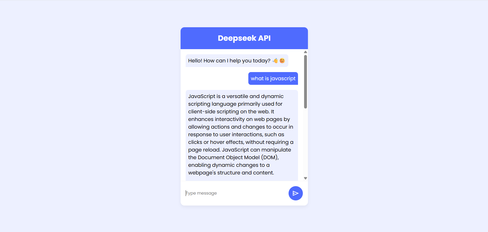

# 🤖 Repo Introduction
### This is a creative chatbot using html css javascript and fetch data from deep seek free API


<br>

# 💻 Techs


 

<br>

# 📺 Demo

### You can see demo of this chatbot [HERE](https://kiyanoosh-kabootaran.github.io/Chatbot/);



<br>

# 📌 Features
- ### clean user interface
- ### Support for user input and bot reponse
- ### Simple design by solid CSS

<br>

# 📊 API
### I used deepseek R1 Distill Limia 70B
### This project will not work for you without your own API KEY
### You can get your api key [HERE](https://openrouter.ai/deepseek/deepseek-r1-distill-llama-70b:free) 
### After receiving your own api key put it here in script.js file 👇

```js
const API_KEY = 'YOUR_API_KEY-HERE';
```
---

<br>


